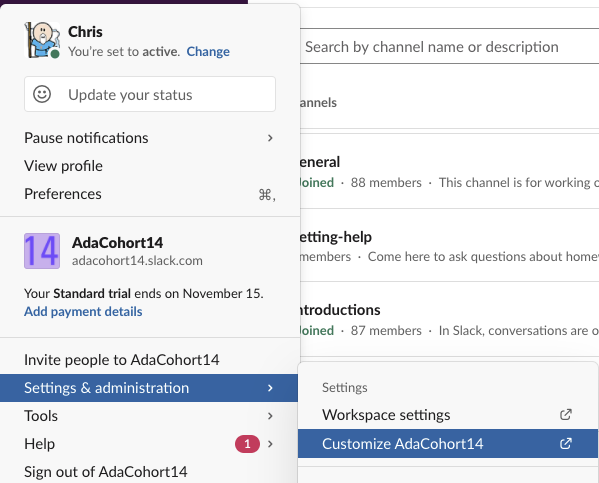
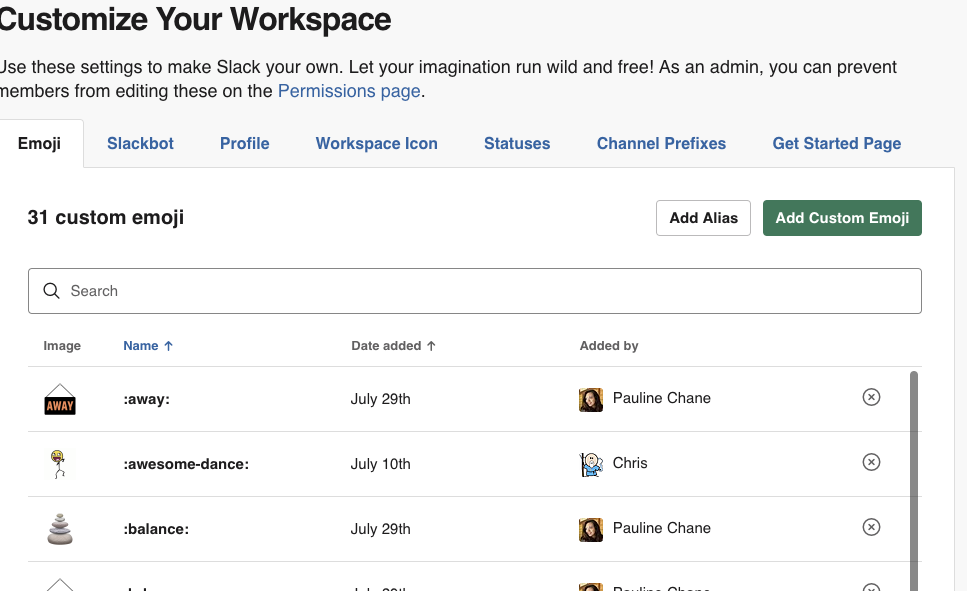
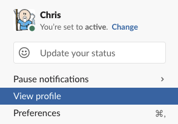
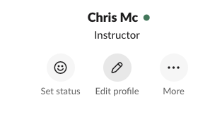
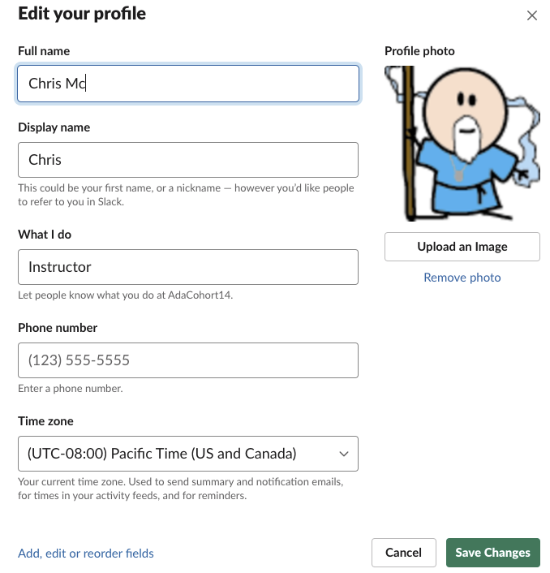

# Slack

At Ada and in the tech industry at large we use Slack.  Slack is a messaging platform used to send text, images and files.  It also has limited support for video chat.  You can use Slack on the browser by going to [slack.com](https://slack.com) and logging in.  Alternatively you can install the [Slack Desktop Client](https://slack.com/downloads/mac) and use the [Slack App for IOS](https://apps.apple.com/us/app/slack/id618783545) or [Slack for Android](https://slack.com/downloads/android).

<iframe src="https://adaacademy.hosted.panopto.com/Panopto/Pages/Embed.aspx?id=dfb4214c-248e-4338-a3c3-ac1800560826&autoplay=false&offerviewer=true&showtitle=true&showbrand=false&start=0&interactivity=all" height="405" width="720" style="border: 1px solid #464646;" allowfullscreen allow="autoplay"></iframe>

## Sending and Reading Messages

You can select a channel or person in Slack and use the messaging panel at the bottom of the screen. You can use a variety of shortcuts to [format your message](https://slack.com/help/articles/202288908-Format-your-messages) as well.  

### Private Messages

You can find other users in the Slack organization on the left-menu below the channels.  You can use the `+` sign and type in the other user's name or names.

## Channels

You can find a list of Channels on the left menu.  Each channel is a group conversation with one or more users.  Each channel typically exists for a specific topic.  

At ada we use a few channels for specific things:

* _annoucements_ - Used for Ada official annoucements about events, or curriculum.
* _csmemes_ - a channel to share funny memes or jokes about programming or technology.
* _pre-ada-homework_ - Used for discussions on the Pre Ada Material

### Creating Channels

You are welcome to create channels for discussions on a topic of interest.  With discussions in Slack please remember and adhere to the Code of Conduct Expectations.

## Customizing Slack

You are welcome to customize slack by adding emojis.

Feel free to experiment and try settings in Slack.

### Adding Emojis

You can also add your own custom emojis to Slack.  You are encouraged to do so, this Slack organization belongs to your cohort, and you are encouraged to take ownership of it.

### Updating Your Profile

You can view and update your profile in Slack including adding an avatar image.

