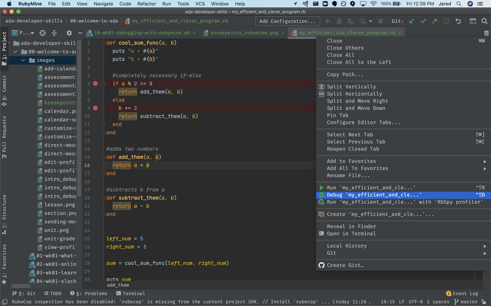

# Debugging with RubyMine

## Learning Goals
- Know how to set up break points and use the step functions
- Understand how to use these tools to better understand what our program is doing and why it is doing it

## Intro
As we discussed in the `Intro to Debugging` lesson, we first and foremost want to approach our code with a place or curiosity, _especially_ when our program isn't doing what we want it to. We've discussed how to investigate and understand what our code is doing using stacktraces, `puts` statements, and rubber ducking. 

In this lesson we'll discover another tool that we can use to help us understand our program, aptly named a _debugger_. Most modern IDEs (such as RubyMine) include debuggers. It is arguably the most useful thing an IDE does for us as developers. 

## Practice

In RubyMine, copy and paste the following code into a new filed named `my_efficient_and_clever_program.rb`:

```ruby
def cool_sum_func(a, b)
  puts "a = #{a}"
  puts "b = #{b}"

  #completely necessary if-else
  if a % 2 == 0
    return add_them(a, b)
  else
    b += 2
    return subtract_them(a, b)
  end
end

#adds two numbers
def add_them(a, b)
  return a + b
end

#subtracts b from a
def subtract_them(a, b)
  return a - b
end

puts "Enter a number: "
left_num = gets.chomp
puts "Enter another number:"
right_num = gets.chomp

sum = cool_sum_func(left_num, right_num)

puts sum
```

This is some very dopey code, but it will show us a lot about how the debugger gives us information.

### Setting A Breakpoint 

Now that we have the debugger prepped, we need to add a `breakpoint`. Breakpoints are like stop-signs alongside your code; they aren't written into the text of the code itself, but they tell the program to halt before continuing to the next command.

We add them in RubyMine by clicking on a line number that we want to stop on. In our current file, lines 6 and 9 are potentially interesting to us. On both lines, click to the left of the line number. When you've finished, you should see 2 red circles near the code. (In case your line numbers don't match ours, compare your breakpoints with the image below.)


### Running the Debugger

With all that done, it's time to see this tool in action. Right-click (or if using your MacBook's trackpad, two-finger click) the filename at the top of the editor and click the option with the green arrow that says "Debug 'my_efficient_and_clever_program.rb'". 



### !callout-info
After starting the debugger, the program should execute until it needs user input. The `Console` pane should popup at the bottom of the screen to allow you to enter two numbers. However, there may be a setting enabled that makes it impossible to enter a number properly. 

If you enter a number and the program prompts you for another number, the setting is already adjusted like we want it and you can ignore this little callout.

If that setting needs to be changed, you should see something that looks like `0>` below the text `Enter a number`. (It may be green.)

There is just a little button that needs to be clicked. The button looks like this:


Once you click it, it should no longer look highlighted and the `0>` should go away. The video goes into a little more detail about this, if you're struggling. Or feel free to get help from a peer, volunteer, or staff member.

### !end-callout

After entering the two numbers requested by the program, RubyMine should look something like this when it hits the first breakpoint. (This should take almost no time. If your screen doesn't look like this, something has gone wrong. You may want to seek support from a classmate, volunteer or staff member.)


There are a few things to highlight here. Firstly, the code has paused on the highlighted line (line 6). The breakpoint has stopped the code here before it finished executing.

Next, the bottom portion of our window has been filled with useful information about variables that are accessible in the current scope. (In this case, `a` and `b`.)

To the left of the "Variables" pane is the Call Stack. The call stack shows every method our program had to call in order to get here. (This is especially useful if you have a function that is called in more than one place.) 

Just above all of that, we see some virtual buttons we haven't seen before:


From Left to Right, here's what they do:

- `Show Execution Point`: Show the line the debugger is currently stopped on 
- `Step Over`: "Step" to the next line of code on the same "level" 
- `Step Into`: "Step" into a method called on the current line or a loop initiated on the current line. If there are multiple possible functions, it will step into the one that is evaluated first 
- `Step Out`: "Step" out of the current function or loop. Any code that hasn't yet been run in the function will finish, and you are returned to the line where the function was called
- `Run to Cursor`: Execute the program like normal but stop once it reaches the line the cursor is currently on

Then on the very left there are a few more virtual buttons we will use: 


From Top to Bottom, here's what they do:

- `Rerun`: Restart the program from the beginning 
- `Resume Program`: Continue execution until the program reaches the next breakpoint or the program finishes
- `Stop`: Stop execution of the program
- `View Breakpoints`: Open a window to display all the breakpoints currently set 
- `Mute Breakpoints`: Temporarily disable all breakpoints without completely removing them


_NOTE:_ You can always view and/or change the hotkeys for any of these commands by navigating to `Preferences` -> `Keymap` and searching the name of the command you want to view or change.

Let's run through these tools to help us debug our current program.

### Using the Debugger

As above, we should see a screen that looks something like this:


As we can see, the 6th line is highlighted. This is the "active line" of code that we are _about to run_. If we want to run it, we can either perform some sort of `Step`, or we can `Resume` execution until the next breakpoint (or the end of the program, whichever comes first). For now, let's `Resume`execution.


As you can see, we skipped ahead to the next line that had a breakpoint. if we check the value of `b` here, we can see that it is still 3. Let's try `Stepping Over`.

<details>
    <summary>
    Question: What changed?
    </summary>
    We can see that the value of `b` is now 5. This only happened once we moved to the next line. In other words, the code on each line is only executed when we Step Over the line.
</details>

Okay, so we have stepped forward, and we've seen a change right before our eyes. Let's see what happens when we `Step Into` another method.


`Step Into` is great when we call a lot of functions in our code. As long as you have the source file for the function being called, you should be able to look at the code that is being executed. **NOTE:** If more than one function is being called on the same line, debuggers `Step Into` functions in the order that they are called, from inner-most to outer-most. Usually, this means that if you are interested in the outer most nested function, you will either need to step in and out of the line several times, or set a breakpoint inside the function that you actually care about.

At this point, we would use the information we gathered during our debugging to articulate to ourselves what our program is doing and why. After ensuring our understanding, we can fix the code, if we identified a bug.

## Why do I care about this?
Great! So now we understand how to start experimenting with the RubyMine debugger. Why do we even want to do that? 

Using a debugger is the go-to tool for most Software Engineers when they want to identify a bug or when they simply want to clarify their understanding of how the program runs. Any time you find yourself wondering why a program isn't doing what you expect, make use of the RubyMine debugger to help you answer that question as you step through the code line-by-line.

## Wrapping Up

Hopefully at this point you feel comfortable enough with RubyMine's debugger that you could set it up in your current project and make use of it the next time you run into issues. 

We encourage you to take some time experimenting with it and getting comfortable with how each debugger button works before you ever even run into a bug.

With such a powerful tool, it can be tempting to neglect the tools we learned in the `Intro to Debugging` lesson: using paper to document the difference between expected behavior and actual behavior, rubber ducking with a peer or an actual rubber duck, reading stacktraces, etc. 

However, there will be times (probably very soon) where you will face a bug and the debugger will not be enough on it's own to help you understand what's going on. Please don't forget the other tools you have! 

The one exception to this is using `puts` statements. As you get more comfortable with the RubyMine debugger, you will likely find that using `puts` statements feels less and less useful, until you eventually stop using `puts` statements altogether.
