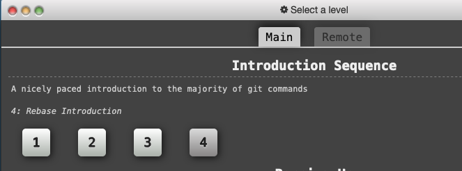

# Managing Git Branches

## Learning Goals

- Explore how Git tracks _branches_
- Learn common uses of the `checkout` command for managing _branches_
- Examine the difference between _merge_ and _rebase_
- Discuss when to _branch_, when to _merge_, and when to _rebase_

## External Branching Tutorial

In this lesson progress through the `Introduction Sequence` lesson (https://learngitbranching.js.org/).  Take notes on the commands to:

- create a branch
- switch between branches
- merge the changes from one branch into another

## Branching Video Lesson

Next watch the following lesson and observe how he illustrates how branches are created and what purposes branches serve. 

<iframe width="560" height="315" src="https://www.youtube.com/embed/oPpnCh7InLY" frameborder="0" allow="accelerometer; autoplay; clipboard-write; encrypted-media; gyroscope; picture-in-picture" allowfullscreen></iframe>

<!-- >>>>>>>>>>>>>>>>>>>>>> BEGIN CHALLENGE >>>>>>>>>>>>>>>>>>>>>> -->
<!-- Replace everything in square brackets [] and remove brackets  -->

### !challenge

* type: short-answer
* id: 4ff73bdb-92da-4e9f-90b9-a58dcf73a4e2
* title: Why is it called a branch?
* points: 1
* topics: git

##### !question

Why do you think the this technique is called branching?  

##### !end-question

##### !placeholder

Why the term branching?

##### !end-placeholder

##### !answer

/.+/

##### !end-answer

<!-- other optional sections -->
<!-- !hint - !end-hint (markdown, users can see after a failed attempt) -->
<!-- !rubric - !end-rubric (markdown, instructors can see while scoring a checkpoint) -->
##### !explanation

Because instead of a long linear line of commits you create a series of commits that "branches" off from the parent branch.  When drawing it out it looks like a tree's branch separating from the main trunk.

##### !end-explanation

### !end-challenge

<!-- ======================= END CHALLENGE ======================= -->

<!-- >>>>>>>>>>>>>>>>>>>>>> BEGIN CHALLENGE >>>>>>>>>>>>>>>>>>>>>> -->
<!-- Replace everything in square brackets [] and remove brackets  -->

### !challenge

* type: short-answer
* id: e50fce3f-b896-4651-b502-62557b6cfbb9
* title: When does git have trouble merging?
* points: 1
* topics: git

##### !question

You create a pull request to pull in changes from the "trip" branch in your Rideshare app, and Github says there is a conflict.  

What could cause this?

##### !end-question

##### !placeholder

Causes of a merge conflict

##### !end-placeholder

##### !answer

/.+/

##### !end-answer

<!-- other optional sections -->
<!-- !hint - !end-hint (markdown, users can see after a failed attempt) -->
<!-- !rubric - !end-rubric (markdown, instructors can see while scoring a checkpoint) -->
##### !explanation

You can get merge conflicts when both branches edit the same line in the same file.  Git can't figure out which changes to keep, or how to combine them.  

So git lets you figure out the best way to merge them.  That's called a _merge conflict_.

##### !end-explanation

### !end-challenge

<!-- ======================= END CHALLENGE ======================= -->

<!-- >>>>>>>>>>>>>>>>>>>>>> BEGIN CHALLENGE >>>>>>>>>>>>>>>>>>>>>> -->
<!-- Replace everything in square brackets [] and remove brackets  -->

### !challenge

* type: multiple-choice
* id: 221b418a-2065-47e9-aebe-a46e29481162
* title: Creating a Branch
* points: 1
* topics: git

##### !question

You want to **create** and **switch to** a new branch called, "Unicorn".  How can you do so?

##### !end-question

##### !options

* `git commit -m "Unicorn"`
* `git branch -D Unicorn`
* `git checkout -b Unicorn`
* `git checkout Unicorn`

##### !end-options

##### !answer

* `git checkout -b Unicorn`

##### !end-answer

<!-- other optional sections -->
<!-- !hint - !end-hint (markdown, users can see after a failed attempt) -->
<!-- !rubric - !end-rubric (markdown, instructors can see while scoring a checkpoint) -->
##### !explanation

If you want to switch to another branch or commit you use `git checkout <branchname>`, if you want to create a new branch with that name and switch to it you use `git checkout -b <branchname>`

`git branch -D <branchname>` will _delete_ the branch!  Be careful!

##### !end-explanation

### !end-challenge

<!-- ======================= END CHALLENGE ======================= -->

## Branches - Reference material

Much of this discussion is going to happen on the whiteboard with sticky notes and drawing. However, here's a list of handy Git commands for working with branches:

### File Commands

- `git checkout [path/to/file]`: reverts any changes to the specified file(s) to their last committed state.
- `git checkout .`: reverts all changes to tracked files to their last committed state.

### Branch Maintenance Commands

- `git checkout [branch_name]`: switches Git to an __existing__ branch.
- `git branch [branch_name]`: creates a new branch _but does not switch to it_.
- `git checkout -b [branch_name]`: creates a new branch and switches Git to this __new__ branch.
- `git branch -a`: shows a list of all local and remote branches.
- `git branch -d [branch_name]`: delete the specified branch

### Branch Sharing Commands

- `git push -u [remote] [branch_name]`: pushes an _untracked_ local branch to the specified remote and instructs Git to keep the two associated. You only use `-u` the very first time you push a new branch upstream.
- `git push [remote] [branch_name]`: pushes commits on the _current branch_ to the _tracked branch_ of a remote.
- `git merge [branch_name]`: performs a recursive merge by first identifying the point of divergence between the _current branch_ and the specified _local branch_ and then applying commits from the specified branch to the current branch in order of commit history.
- `git pull [remote]`: Same as `merge`, except it directs Git to merge a _remote branch_ with the current local branch.

### Rebase Commands

- `git rebase [branch_name]`: performs a _rebase_ of the current branch. Rebase is a three step process:
  - Rebase identifies the point of divergence between the current branch and the specified branch
  - Rebase rewinds the current branch to the point of divergence
  - Rebase then applies new commits from the specified branch to the current branch
  - Finally, rebase applies the commits unique to the current branch _as new commits to the top of the current branch_.
- `git pull [remote] --rebase`: Same as `rebase`, except it directs Git to rebase a _remote branch_ with the current local branch.

## Resources

[Git SCM Documentation](https://git-scm.com/book/ch3-2.html)  
[Atlassian Tutorial](https://www.atlassian.com/git/tutorials/using-branches)
