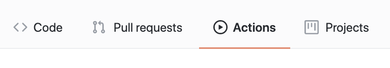

# Continuous Integration

<iframe src="https://adaacademy.hosted.panopto.com/Panopto/Pages/Embed.aspx?pid=643bbbdc-a49e-4ea7-9f48-ac6e015ebfde&autoplay=false&offerviewer=true&showtitle=true&showbrand=false&start=0&interactivity=all" height="405" width="720" style="border: 1px solid #464646;" allowfullscreen allow="autoplay"></iframe>

## Learning Goals

By the end of this lesson, we will be able to...

- Define _continuous integration_
- Describe how _continuous integration_ can help improve the development workflow
- Set up a _continuous integration_ workflow for a Rails app using TravisCI

## Introduction: What Is Continuous Integration

From [ThoughtWorks](https://www.thoughtworks.com/continuous-integration):

> Continuous Integration (CI) is a development practice that requires developers to integrate code into a shared repository several times a day. Each check-in is then verified by an automated build, allowing teams to detect problems early.

The big idea behind continuous integration is a codebase is easier to maintain if everyone is looking at a similar version of the code. If developers or teams drift apart, then reconciling changes becomes difficult and expensive. To that end everyone should be working on a common code base, merging in changes ("integrating") continuously.

In git terms, this means that every developer should be pulling from and pushing to the `master` branch frequently.

Testing is a key component of CI. When changes are coming in so often, it would be easy for two changes to conflict, resulting in a "broken" `master` branch. The solution to this is to require two things:

- Every change to the code must include thorough tests
- Integration is "gated" on the tests - if the tests don't pass, the code can't be merged

If those two rules are always followed, then the `master` branch will always be in good working order. Real life is often more complex of course, but this is still a good starting point.

A common way to enable CI is to use a tool like [TravisCI](https://travis-ci.org/) to automatically run the tests. You can even configure GitHub to require a green test run before code can be merged.

If you have faith in your tests, you can even do fancy things like automatically re-deploying to Heroku every time the `master` branch is updated.

### CI Workflow Example

Katherine and Grace are working on a project together. They collaborate on planning and their initial project setup, then separate to work individually.

Before they separate, Katherine and Grace agree on a few rules for how they will work:

- The `master` branch is considered "pristine", meaning the test suite on `master` always passes all the tests
- All new development work, bug fixing, etc. is done on branches
- The only way for work to come into `master` is via a pull request
- Every pull request must include thorough tests for any new or changed code, and the entire test suite must pass with coverage > 95% for the PR to be accepted

Katherine has decided to add login functionality via Google to the site, and is working on a branch called `google_oauth`. Once they are ready to integrate their code, they follow the following process:

1. Run the full test suite, ensuring all tests pass
1. Pull in changes from `master`
1. Run the full test suite again, ensuring all tests pass
1. Push the `google_oauth` branch to GitHub
1. Open a new PR from the `google_oauth` branch against the `master` branch
    - When the PR is opened, TravisCI will automatically begin to run the test suite
1. Ask Grace to perform a code review
1. If Grace requests changes to the code, Katherine can make the changes on the branch and push again
    - This will trigger another test run via TravisCI, cancelling the old one if it is still in progress
1. Once the PR has been approved _and_ TravisCI has passed the test suite, the branch can be merged into `master` via the GitHub web interface

## Setting Up TravisCI

To complete the exercise in this section, you will need a working Rails application. MediaRanker might be a good choice. Bonus points if it's deployed.

In stead of giving you specific instructions, this activity is an exercise in reading documentation!

To get you started, here are a couple resources:

- [TravisCI's Tutorial](https://docs.travis-ci.com/user/tutorial/)
- A basic `.travis.yml` file for a Rails project
  
    ```yml
    language: ruby
    rvm:
      - 2.6.5
    cache: 
      - bundler
      - yarn
    services:
      - postgresql
    before_install: 
      - nvm install --lts
    before_script:
      - bundle install --jobs=3 --retry=3
      - yarn
      - bin/rails db:create
      - bin/rails db:migrate

    script:
      - bin/rails test
    ```

Once you have it running tests against `master`, submit a pull request and see what happens. Can you configure GitHub to block PRs without a successful test run from TravisCI?

As an extra challenge, configure TravisCI to automatically deploy the `master` branch to Heroku. 

<!-- available callout types: info, success, warning, danger, secondary  -->
### !callout-warning

## Travis-ci.org vs Travis-ci.com

Be aware that Travis-ci is transitioning from a .org domain name to .com, and the .org no longer works as reliably.  So stick to the .com domain!  

The .org domain will also dissapear after December 31st 2020.

### !end-callout

## Optional Github Actions Example

Similar to Travis CI github provides a way to automatically run tests and take actions like merging PRs upon tests passing.  To do so, you create a `.yml` file inside a folder `/github/workflows`

To create an example workflow inside a rails project:

```
mkdir .github
mkdir .github/workflows
touch .github/workflows/run_tests.yml
```

Sample `.github/workflows/run_tests.yml` file.

```yml
# Name of the workflow
name: Run Tests
# When to run this workflow
on:
  pull_request:
    branches:
      - 'master'
jobs:
  # Jobs to run
  tests:
    name: Tests
    # What kind of machine to set up the project on
    runs-on: ubuntu-latest
    # Services this project needs (postgres and redis)
    services:
      postgres:
        image: postgres:11.5
        ports: ["5432:5432"]
        options: --health-cmd pg_isready --health-interval 10s --health-timeout 5s --health-retries 5
      redis:
        image: redis
        ports: ["6379:6379"]
        options: --entrypoint redis-server

    # Steps to run 
    steps:
      # Get the source code
      - name: Checkout code
        uses: actions/checkout@v2
      # Install ruby 2.6.5
      - name: Setup Ruby 2.6.5
        uses: ruby/setup-ruby@v1
        with:
          ruby-version: 2.6.5

      # install tool to interact with postgres
      # apt-get is like brew install
      - name: Install PostgreSQL 11 client
        run: |
          sudo apt update
          sudo bash -c "echo deb http://apt.postgresql.org/pub/repos/apt/ bionic-pgdg main >> /etc/apt/sources.list.d/pgdg.list"
          wget --quiet -O - https://www.postgresql.org/media/keys/ACCC4CF8.asc | sudo apt-key add -
          sudo apt-get update
          sudo apt-get -yqq install libpq-dev postgresql-client-11          

      # Set up the app with bundle install and yarn etc
      - name: Build App
        env:
          PGHOST: localhost
          PGUSER: postgres
        run: |
          rm *.lock
          gem install bundler
          yarn
          bundle install --jobs 4 --retry 3
          bin/rails db:setup
  
      # Then run the tests
      - name: Run Tests 
        env:
          PGHOST: localhost
          PGUSER: postgres
          RAILS_ENV: test
        run: |
          bundle exec rake test
```

Then in github you can go to the actions tab and enable the actions.



## Summary

- Continuous integration is a development practice used to prevent developers from getting out of sync with each other
- CI relies heavily on testing
    - Integration (merging) is "gated" on testing
    - CI doesn't work if you don't write good tests
- CI and strong testing practices can enable other things like automatic deployment
 
## Additional Resources

- [ThoughtWorks on Continuous Integration](https://www.thoughtworks.com/continuous-integration)
- [Microsoft Azure: What is Continuous Integration](https://docs.microsoft.com/en-us/azure/devops/learn/what-is-continuous-integration)
- [TravisCI: Core Concepts for Beginners](https://docs.travis-ci.com/user/for-beginners/)