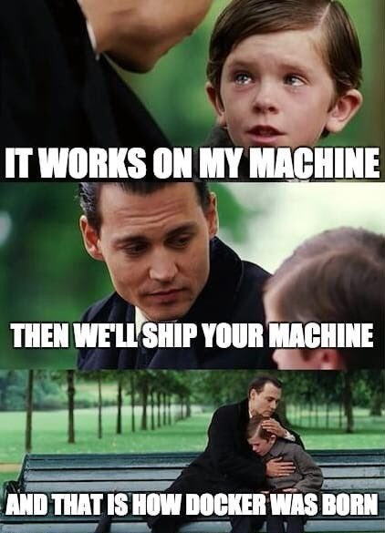
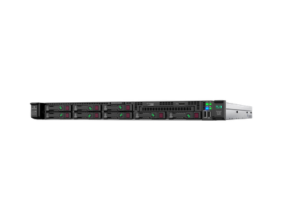
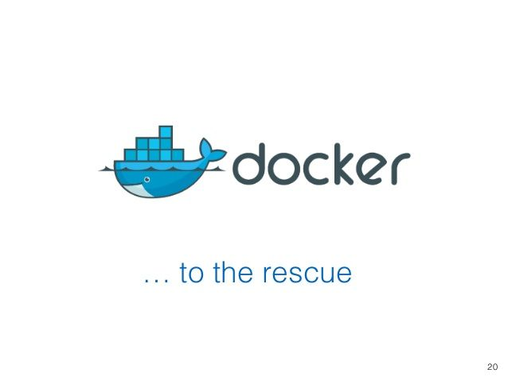
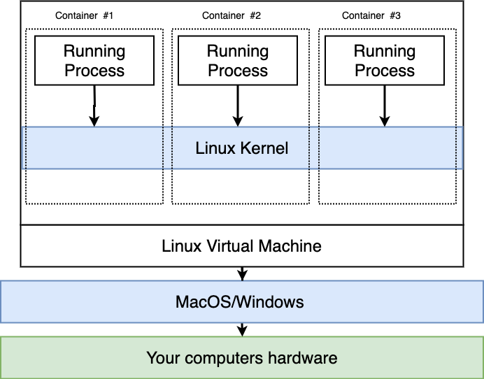

# Docker Introduction



## Learning Goals

By the end of this lesson you should be able to:

- Explain what Docker & Containerization are
- Read a basic Dockerfile
- Explain what docker-compose does
- Build a simple Express app with Docker

## What is Docker & Containerization

Docker is a set of platform as a service (PaaS) products that use OS-level virtualization to deliver software in packages called containers.

**What?**

Lets do some vocabularly and history.  In the _old_ days when you wanted to launch a service on the web you bought a server (see image below) and then:

- Installed the Operating System
- Installed all your app's dependencies
- Installed your app
- Configured your app
- Debugged your mistakes
- Then connected your server to the internet and launched your service



This was too much work, and a service might only use a portion of the CPU and memory available to the server.  We could (and did) install multiple services on the same server, but then ran the risk of conflicts between the services.  What is one app required Ruby 2.3 and another required 2.4?  What if they both used conflicting version of python?  What if one app crashed a database other apps shared!

### Enter Virtualization!

Instead of installing everything on one "bare metal" machine we set up the physical server to emulate many servers.  Using software like Virtualbox, Hyper-V or VMWare one computer could run emulators pretending to be many servers, each with their own operating systems, disk space, software libraries etc.  Each **virtual machine** runs independently of the others consuming a portion of the physical server's resources.  

This was a great deal more efficient, but you still had to...

- Installed the Operating Systems
- Installed all your app's dependencies
- Installed your app
- Configured your app
- Debugged your mistakes
- Then connected your server to the internet and launched your service

Just on a virtual machine, instead of a physical one!  Still too much work!


### Docker To The Rescue



Now Docker enters the picture.  When you install Docker it installs **one** linux virtual machine.  Instead of configuring a new computer for each app, we take advantage of the Namespace feature of Linux.  

If you run an set of software in a namespace, it runs separately from all other applications and code.  Each namespace operates **independently** in terms of library code, CPU, Memory and hard disk space.  So you can have Python 2 running in one namespace and Python 3 running in another.  You can also have conflicting library code installed in sparate namespaces without conflict.



_[image from Docker & Kubernetes: The complete Guide](https://www.udemy.com/share/101WjMAkEacV9UQn4=/)_

### Docker Terminology

- **Docker Client** - A tool which provides a command-line interface (CLI) that lets you build run and stop application commands to the Docker daemon.  The **docker** command.
- **Docker Server** - a tool designed to make it easier to create, deploy, and run applications by using containers.  You installed it when you installed Docker on your computer.
- **Docker Machine** - a tool that lets you install Docker Engine on virtual hosts, and manage the hosts with docker-machine commands.  You can use it to create Docker hosts on a local computer or cloud hosted machines.
- **Docker Image** - a file, comprised of multiple layers, used to execute code in a Docker container.  It's used to build and run an app in a container.
- **Docker Hub** - a cloud-based repository in which Docker users and partners create, test, store and distribute container images.  Like github for Docker images!
- **Docker Compose** - a tool for defining and running multi-container Docker applications. With Compose, you use a YAML file to configure your application's services.

## Building An Express App with Docker

We are going to create a Docker Image, and install a JavaScript Express App on it.  Express is a minimalist Javascript library for building a server-side application.  You can think of it like a JavaScript equivalent to a rails app without nearly as much done for you.  Then we will use Docker Compose to set up two images, one for the Rails web service and one for Postgres and then get them to talk to one another.  

We will do this all using a [Example Express App](https://github.com/AdaGold/docker-example).

### Before we get started

Before we can start we need to install docker:

```
brew cask install docker
```

This will install the docker client and server on your computer.  You will also need to go to https://hub.docker.com and create an account.

### Dockerfile

Move into the project and create a new file named `Dockerfile`.  Capitalization matters!

```bash
$ git clone git@github.com:AdaGold/docker-example.git
$ cd docker-example
$ touch Dockerfile
```

The first thing we'll add is this line to the `Dockerfile`

```dockerfile
# Starting Image
FROM node:14-alpine
```

This command starts our image from a base that someone else on Docker Hub created.  This image is of a basic linux machine with node version 14 installed.  That sounds like a good place to start!  You can see the list of Node Docker images on [docker hub](https://hub.docker.com/_/node) and this specific parent image [Dockerfile on github](https://github.com/nodejs/docker-node/blob/ad676318f09f9dee821ac6704340000d75fe31bc/14/alpine3.11/Dockerfile).

**Note** You should pick a base image to match the dependencies your app requires.


#### Installing Dependencies

This is great, it has node installed, but not `yarn`...  Well we could use `npm`, but if we **really** want to use `yarn` we can do this:

```Dockerfile
# Starting Image
FROM node:14-alpine

# Create a folder for our app and make
# it the working directory
RUN mkdir /app
WORKDIR /app


# Install Yarn
RUN apk add --update \
    curl \
    && rm -rf /var/cache/apk/*
RUN apk add yarn
```

`APK` stands for Alpine Linux package manager. You use the apk command to delete, install, upgrade, or list software on a running Alpine Linux based system.

#### Set Working Directory and Installing App

Next we will set `/app` as the working directory for our app, copy over the package.json file and run `yarn` to install all the packages.  Then we will copy over the rest of our application files.

```Dockerfile
# Set parent image and install dependencies
# Starting Image
FROM node:14-alpine

# Create a folder for our app and make
# it the working directory
RUN mkdir /app
WORKDIR /app


# Install Yarn (our only dependency)
# Tell Container where to find Yarn
RUN apk add --update \
    curl \
    && rm -rf /var/cache/apk/*
RUN apk add yarn

# Install application to /app
COPY package.json yarn.lock /app/
RUN yarn install --production=true

COPY . /app
```

We did this so because Docker by default, when it notices a change will re-run all subsequent lines in the Dockerfile.  So if we modified a controller, we don't want the container to re-run `yarn install`.  So we copy the application code later and the `package.json` first.  This way only if the `package.json` changes, will we re-run `yarn install`.

#### Start our Application

Next we will open up port 3000, so we can see our application in the browser and tell Docker to start the application with the command `yarn start`, notice the `package.json` file has a script which runs `node` and the argument `bin/www`.  

In the `bin` folder there's a file called `www` which is a JavaScript file to start the app with.

_Dockerfile_
```dockerfile
# Set parent image and install dependencies
# Starting Image
FROM node:14-alpine

# Create a folder for our app and make
# it the working directory
RUN mkdir /app
WORKDIR /app


# Install Yarn
# Tell Container where to find Yarn
RUN apk add --update \
    curl \
    && rm -rf /var/cache/apk/*
RUN apk add yarn

# Install application to /app
COPY package.json yarn.lock /app/
RUN yarn install --production=true

COPY . /app

# Open up port 3000 to the browser
EXPOSE 3000

# Start the app with "node bin/www"
CMD ["yarn", "start"]
```

Then we can build a docker image on our computer with:

```bash
docker build -t nodejs-express-docker:latest .
```

Go get a coffee, this will take a bit, but by the end we'll have an image file with all the instructions needed to start a container with our app.

We can now run the app with:

```bash
docker run --rm --name nodejs_express -d -p 3000:3000 nodejs-express-docker:latest
```

This command does the following:

- **docker run** - Run the docker container
- **-rm** - remove the container when it exits
- **--name nodejs_express** - name the running container instance `nodejs_express`
- **-d** - Run it in detached mode (you get the terminal back)
- **-p 3000:3000** - Make it so that port 3000 on your computer connect to port 3000 on the container
- **nodejs-express-docker:latest** - The name of the Docker image to create

### Docker Compose

That's a lot to type to run the application.  We can make it easier by creating a `docker-compose.yml` file.  This file tells Docker how to build and start the app.  

In this file we define a service called `web` (our container) from the current folder `./`.  We also tell it that if you go to port 3000 on our computer it forwards the request to port 3000 on the container.

```yml
# Version of docker-compose
version: '3.9'
# List of services to run (just one called web)
services:
  web:
    build:
      context: .
    volumes:
      - .:/app
    command: yarn start
    ports:
      - "3000:3000"
```

### Starting and Stopping Stuff

We can now start our containers with the command:

```bash
$ docker-compose up
```

You can exit the app with `ctrl-c`.

### Multi-Container Docker Apps

You often have multiple services in an application.  Think about Rails.  With Rails you have both Postgres and Rails running when you start the app.  You can use a `docker-compose.yml` file to define an app with multiple containers and have them securely communicate together.  

The following is a `docker-compose.yml` taken from [the official Docker tutorials](https://docs.docker.com/compose/rails/) for a Rails 5 application.

```yml
# Version of Docker compose
version: "3.9"
services:
  # Set up a Postgres Container from the postgres image
  # on Docker Hub
  db:
    image: postgres
    volumes:
      - ./tmp/db:/var/lib/postgresql/data
    environment:
      POSTGRES_PASSWORD: password
  # Build a rails app from the current folder's Dockerfile and call it "web"
  web:
    build: .
    command: bash -c "rm -f tmp/pids/server.pid && bundle exec rails s -p 3000 -b '0.0.0.0'"
    volumes:
      - .:/myapp
    ports:
      - "3000:3000"
    depends_on:
      - db
```

## What about this Kubernetes Thingy I Heard About...

Kubernetes is a tool which lets you coordinate a bunch of containers and container groups.  You feed Kubernetes a description of a state you want created, which services, loads etc.  It creates a bunch of container hosts (virtual machines) and installs containers on them.  You give Kubernetes a file `app.yaml` a description of different pods (the smallest unit of services) and which containers you want to run on them.  Kubernetes then orchestrates them and ensures the configuration is maintained as things run.  When something goes down it can work to bring them back up again.

## Summary

Docker is a tool which lets you define a list of software to install and run independently of the host machine.  Then any machine which has the `Dockerfile`, source code and `docker-compose.yml` can run your service.  Docker allows you to run any set of services, Rails, Express, Django etc on any host machine independent of any other services on the computer.

## Resources

- [Docker Hub](https://hub.docker.com/)
- [Getting Started with Docker](https://docs.docker.com/get-started/)
- [Offical tutorials with Rails, Django etc](https://docs.docker.com/samples/#sample-applications)
- [Stephen Grider's Docker & Kubernetes course, the source of many diagrams here](https://www.udemy.com/share/101WjMAkEacV9UQn4=/)
- [Kubernetes in 5 minutes](https://www.youtube.com/watch?v=PH-2FfFD2PU)
